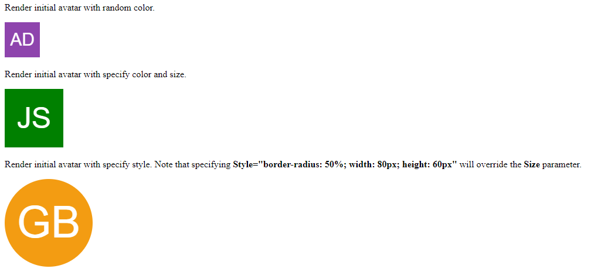

# Blazor Avatar

This Blazor library provides components that render avatar.
Currently this library only supports initial avatar.

This library has been tested only with Blazor WebAssembly.

# Install
Install package from [Nuget](https://www.nuget.org/packages/Blazor.Avatar).
```
dotnet add package Blazor.Avatar --version <latest-version>
```

Register `Blazor.Avatar` dependencies by calling `AddAvatarComponents()` in `Program.cs`.
```cs
using Blazor.Avatar;

var builder = WebAssemblyHostBuilder.CreateDefault(args);
builder.RootComponents.Add<App>("#app");
builder.RootComponents.Add<HeadOutlet>("head::after");

builder.Services
  .AddAvatarComponents()
  .AddScoped(sp => new HttpClient { BaseAddress = new Uri(builder.HostEnvironment.BaseAddress) });

await builder.Build().RunAsync();
```

Load the `dotnet-callback.js` script by adding the line below in your `wwwroot/index.html` file.
```html
<script type="module" src="_content/Blazor.Avatar/js/dotnet-callback.js"></script>
```
The reason this script is needed because some components can accept C# callback (like `Func<>` 
or `Action<>`), and this script helps serialize these callbacks to JS callbacks.

# Usage
You can clone this repo and run the `samples/Blazor.Avatar.Samples.WebAssembly`
project to see how the avatars are generated.

Alternatively you can view the sample project hosted
on [Github page](https://pandabytes.github.io/blazor-avatar/).

## Initial Avatar
Use the `InitialAvatar` component in your Razor file.
```razor
@page "/"
@using Blazor.Avatar.Components.InitialAvatarComponent

<p>Render initial avatar with random color.</p>
<InitialAvatar FirstName="Aaron"
               LastName="Doe" />

<p>Render initial avatar with specify color and size.</p>
<InitialAvatar FirstName="Jane"
               LastName="Smith"
               FillColor="green"
               Size=100 />

<p>
  Render initial avatar with specify style. Note that
  specifying <b>Style="border-radius: 50%; width: 80px; height: 60px"</b>
  will override the <b>Size</b> parameter.
</p>
<InitialAvatar FirstName="gavin"
               LastName="baker"
               Size=150
               Style="border-radius: 50%" />

```

The above Razor code will be rendered like this:


## Identicon Avatar
This is pretty much a wrapper of this JS library: https://github.com/laurentpayot/minidenticons. This library is currently using version `4.2.1` of this JS minidenticons library.

```razor
<PageTitle>Identicon Avatar</PageTitle>

<h1>Identicon Avatar</h1>

<IdenticonAvatar Username="x" 
                 Saturation=58
                 Lightness=22
                 Style="background-color: green; display: list-item; height: 148px; width: 148px;" />

<IdenticonAvatar Username="feeding bird in forest"
                 Saturation=58
                 Lightness=9
                 HashFunc="@(s => 1234)"
                 Style="background-color: grey; height: 300px; width: 300px;" />
```

## DiceBear Avatar
This is a wrapper for [DiceBear](https://www.dicebear.com) avatar.

The complete list of available styles are documented in
[here](https://www.dicebear.com/styles/).

The official DiceBear playground is
[here](https://www.dicebear.com/playground/).

```razor
<DiceBearAvatar AvatarStyle="thumbs" DefaultSeed="john" />

<DiceBearAvatar AvatarStyle="bigSmile" Options="@(new Dictionary<string, object> { { "seed", "jane" }, { "flip", true } })" />
```
